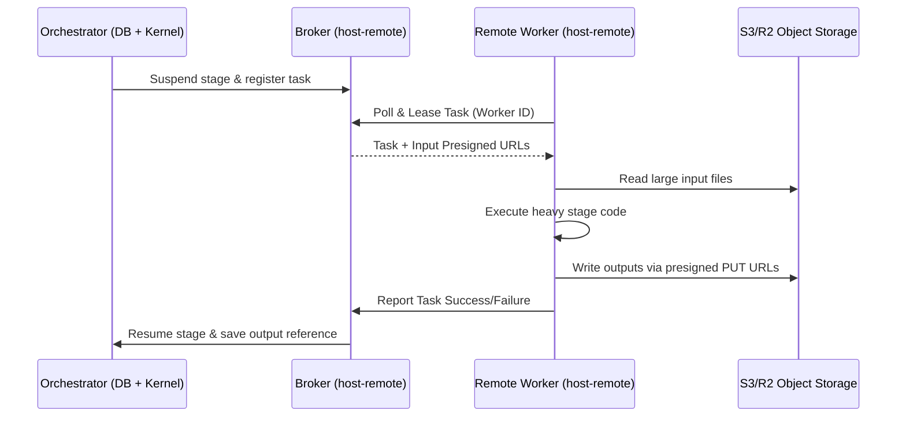

# Remote Activity Workers

The **Remote Activity Worker** package (`@bratsos/workflow-engine-host-remote`) allows you to run heavy or specialized workflow stages (e.g. video transcoding, ffmpeg processing, or deep LLM inference) on separate, ephemeral worker machines. 

Under this model, the worker nodes hold **zero standing credentials** (no database connection, and no root object-storage credentials). The worker leases tasks from the orchestrator, writes large binary outputs directly to object storage via **presigned URLs**, and reports execution results back to the central orchestrator using HTTP.

---

## Architecture Overview



---

## Wiring Models

### 1. Proxy Stage (Recommended for Long Tasks)
Use `defineRemoteStage` to wrap your heavy stage definition. When reached, the orchestrator suspends the stage, registers it on the broker, and waits for a worker to execute it and report back. This releases the core job lease so the orchestrator isn't locked while waiting.

```typescript
import { defineRemoteStage } from "@bratsos/workflow-engine-host-remote";
import { WorkflowBuilder } from "@bratsos/workflow-engine";

const workflow = new WorkflowBuilder(...)
  .pipe(defineRemoteStage(heavyVideoStage, oTransport, {
    pollIntervalMs: 5_000,
    maxWaitMs: 3_600_000, // 1 hour timeout
    stageCodeVersion: "v1", // Must match the version on the workers
  }))
  .pipe(cleanupStage)
  .build();
```

### 2. ActivityExecutor Port (Short Tasks / Custom Routing)
Alternatively, you can route execution dynamically using the kernel's `ActivityExecutor` port. The default executor is `createLocalExecutor()`, but you can wrap it with `createRoutingExecutor` to delegate select stage IDs to remote hosts:

```typescript
import { createRemoteExecutor } from "@bratsos/workflow-engine-host-remote";
import { createRoutingExecutor, createLocalExecutor } from "@bratsos/workflow-engine/kernel";

const kernel = createKernel({
  ...,
  executor: createRoutingExecutor({
    remote: createRemoteExecutor(oTransport),
    remoteStageIds: ["heavy-transcode", "batch-embedding"],
  }),
});
```

---

## Configuring the Worker Fleet

Workers run in their own process, loading only `@bratsos/workflow-engine-host-remote` and the specific stage code (no Prisma client, no direct DB dependencies).

```typescript
import { createActivityWorker, createHttpWorkerTransport } from "@bratsos/workflow-engine-host-remote";
import { transcodeStage } from "./stages/transcode";

const transport = createHttpWorkerTransport({
  baseUrl: "https://orchestrator-broker.internal",
  authToken: process.env.BROKER_AUTH_TOKEN,
});

const worker = createActivityWorker({
  workerId: "worker-gpu-1",
  stageIds: ["heavy-transcode"],
  stageCodeVersion: "v1",
  registry: new Map([["heavy-transcode", transcodeStage]]),
  transport,

  // Optional (v0.11+)
  onError: (error, { consecutiveFailures }) => {
    // Called when the poll/execute loop encounters errors (e.g. auth, lease fencing)
    console.error(`Worker error: ${error.message}. Consecutive failures: ${consecutiveFailures}`);
  },
  maxBackoffMs: 30_000, // Caps backoff delay between consecutive failures (default: 30s)
});

worker.start();
```

---

## Configuring the Orchestrator (Broker)

The orchestrator serves the HTTP endpoint that workers connect to.

```typescript
import { Broker, InMemoryBrokerStore, createBrokerHttpServer, createS3Presigner } from "@bratsos/workflow-engine-host-remote";

const presigner = createS3Presigner({ 
  bucket: "my-artifacts", 
  region: "us-east-1" 
});

const broker = new Broker({
  store: new InMemoryBrokerStore(),
  presigner,
  stageCodeVersion: "v1",
  clock: { now: () => new Date() },
});

// Start the HTTP listener
const server = createBrokerHttpServer({ 
  broker, 
  objectStore: presigner, 
  authToken: process.env.BROKER_AUTH_TOKEN 
});
server.listen(3000);
```

---

## Durability, Fencing, and Safety

### Durable Reports
To prevent duplicate execution when the orchestrator restarts, workers write their results to a deterministic key in object storage *before* calling the HTTP `/report` API. On restart, the proxy stage reads this object storage reference and recovers the completed state automatically.

### Fencing & Cancellation (v0.11+)
When a workflow is cancelled on the orchestrator, active jobs are marked as cancelled. During the worker's heartbeat poll, the broker detects the cancellation and sends a cancel signal to the worker.
* The worker ignores the output presigning and skips reporting to object storage, avoiding errors from executing reports on expired/fenced leases.

### Version-Lock Safety
Bumping `stageCodeVersion` acts as a deploy barrier. If a task was suspended using version `v1` but a worker attempts to fetch it with version `v2`, the broker rejects the lease, preventing code mismatch errors.
